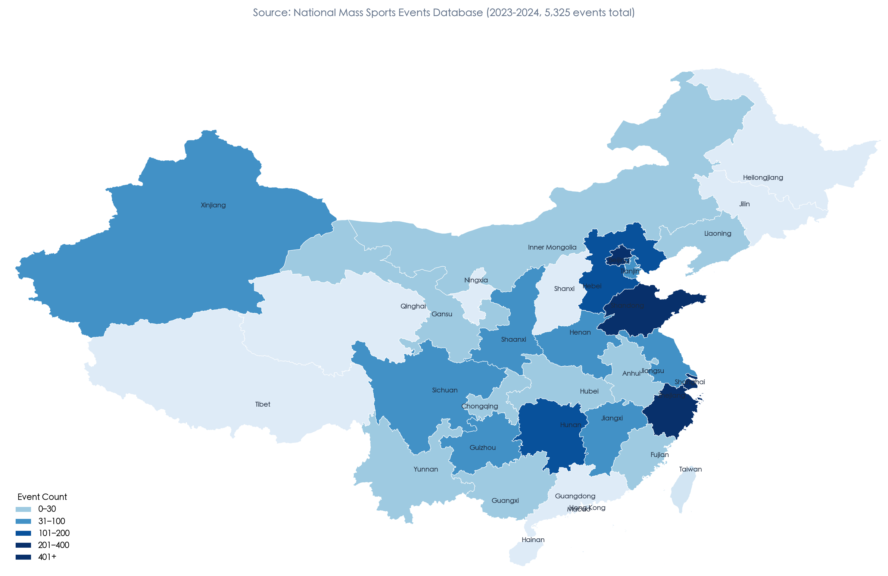
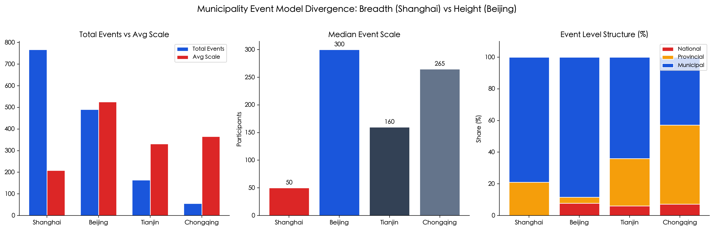
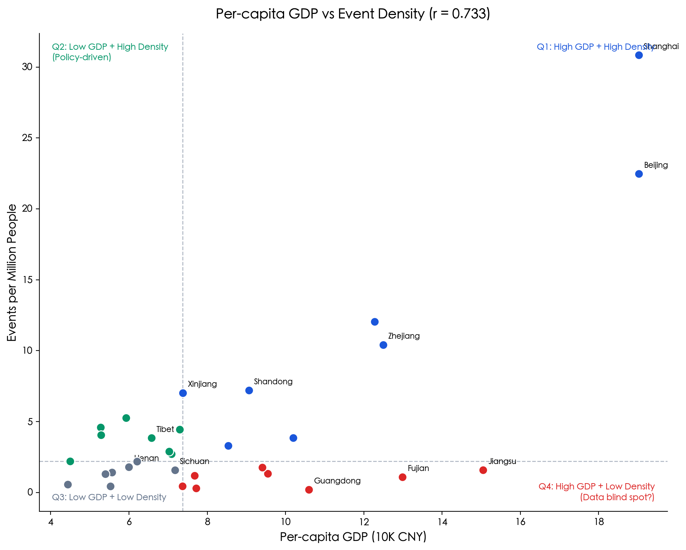
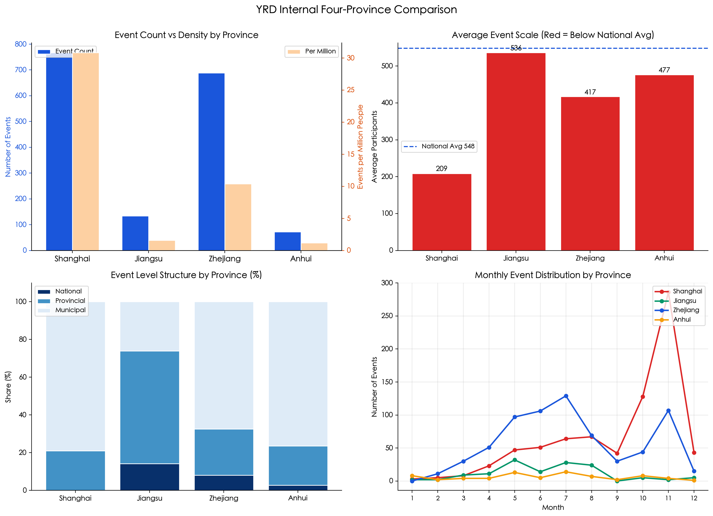

# China Youth Sports Events Data Analysis

[English](README_EN.md) | [中文](README.md)

Based on 2023-2024 national youth sports event data (5,325 records in total), this project performs data cleaning, exploratory analysis, and visualization from the perspective of youth sports consumption behavior. It introduces demographic and economic dimensions for multivariate correlation analysis, with a special focus on the Yangtze River Delta (YRD) region.

## Project Background

The data is sourced from the **National Mass Sports Events Database**, aiming to understand the patterns of youth sports participation and consumption behavior from the supply-side perspective of sports events.

## Data Description

| Field | Description |
|-------|-------------|
| Source | National Mass Sports Events Database |
| Volume | 5,325 records (2,742 from 2023 + 2,583 from 2024) |
| Coverage | 31 provinces/municipalities/autonomous regions, 39 sports |
| Key Fields | Province/City/District, Event Level, Sport, Event Scale, Start/End Date |

> ⚠️ **Data Quality Issues**: Cross-validation reveals significant provincial coverage gaps (Guangdong, Jiangsu, and Sichuan show the most notable deviations). Some fields (municipality event level classification, sport name noise) required manual cleaning. Inter-provincial rankings and density comparisons should be interpreted with caution.

## Key Findings

| # | Conclusion |
|---|------------|
| 1 | **Regional Distribution**: Highly concentrated in eastern China — Shanghai, Shandong, and Zhejiang together account for ~40% of national events |
| 2 | **Municipality Divergence**: Shanghai follows a "breadth coverage" model (767 events, median 50 participants), while Beijing follows a "height elite" model (491 events, median 300 participants, including high-cost sports like golf and equestrian) |
| 3 | **Consumption Structure**: Racket sports (tennis/badminton/table tennis) have smaller scale (avg 296 participants) but higher unit prices; team ball sports (football/basketball/volleyball) lead on both counts (avg 713 participants, football ranks #1 nationally with 537 events) |
| 4 | **Driver Stratification**: Personal preference/school requirements (intrinsic), parental economics (decision-making), spatial conditions (constraints) — three progressive layers |
| 5 | **Emerging Sports**: Climbing/breakdancing now Olympic events; venue barrier differences (ice hockey very high vs breakdancing very low) determine replication speed |
| 6 | **Event Rhythm**: Peak in Jul-Aug (summer break), trough in Jan-Feb (winter break), highly correlated with school calendar |
| 7 | **Populous Provinces**: Event count does not correlate with population — Guangdong (0.2 events/million) and others are largely data blind spots |
| 8 | **Economic Correlation**: Per-capita GDP and event density show a strong positive correlation (r=0.73) |
| 9 | **Frontier Characteristics**: Tibet, Xinjiang and other regions show inflated event density, primarily policy-driven rather than market-driven |
| 10 | **YRD Region**: With 16.9% of the population, it contributes 31.2% of events — density 1.9× the national average, but with lower average scale (boutique small-scale events) |
| 11 | **YRD Internal**: Shanghai/Zhejiang are market-driven (municipal/community events), Jiangsu is administration-driven (60% provincial-level) — significant structural divergence |

### Chart Preview

<p align="center">

</p>

<p align="center">Provincial distribution heatmap — highly concentrated in eastern coastal areas</p>

<p align="center">

</p>

<p align="center">Municipality event model divergence — Shanghai "breadth" vs Beijing "height"</p>

<p align="center">

</p>

<p align="center">Per-capita GDP vs event density four-quadrant analysis (r=0.73)</p>

<p align="center">

</p>

<p align="center">Internal structural divergence within the YRD region</p>

> All 13 charts are in `output/charts/`. Full analysis report: `docs/README.pdf`.

## Project Structure

```
china-youth-sports-analysis/
├── README.md                  # Chinese README
├── README_EN.md               # English README (this file)
├── requirements.txt           # Python dependencies
├── main.py                   # Main entry: one-click full pipeline
├── config.py                 # Config: paths, fonts, demographic/economic constants
├── data/                    # Data directory (includes raw data, clone-and-run)
│   ├── 全国群众体育赛事、青少年体育赛事、马拉松赛事信息.xlsx   # Raw data
│   └── 青少年体育赛事_清洗后.csv   # Cleaned data (regeneratable)
├── src/
│   ├── __init__.py
│   ├── data_cleaning.py      # Data cleaning (drop nulls, unify levels, time processing)
│   ├── analysis_core.py      # Core analysis (region/municipality/consumption/drivers/emerging/monthly)
│   ├── analysis_economy.py  # Demographic-economic correlation (density, correlation, quadrants)
│   ├── analysis_yrd.py      # YRD regional analysis (vs national, internal divergence)
│   └── visualization.py     # Chart generation
├── output/
│   ├── charts/              # Generated charts (13 .png files)
│   └── reports/            # Analysis report output
└── maps/                   # China province GeoJSON (for charts 01/07)
```

## Usage

### 1. Install Dependencies

```bash
pip install -r requirements.txt
```

> **Font Support**: The `setup_chinese_font()` function in `config.py` auto-adapts to macOS (PingFang/STHeiti), Windows (Microsoft YaHei), and Linux (Wenquan), no manual configuration needed.

### 2. Run

The project includes built-in raw data files (`data/` directory), so you can run directly after cloning:

```bash
python main.py
```

Pipeline steps:
1. Data cleaning → outputs `data/青少年体育赛事_清洗后.csv`
2. Core analysis → prints results to terminal
3. Demographic-economic analysis → prints correlation and quadrant analysis
4. YRD regional analysis → prints results
5. Generate 13 visualization charts → outputs to `output/charts/`

### 3. Run Individual Steps

```bash
python main.py --clean-only    # Data cleaning only
python main.py --viz-only      # Charts only (requires prior cleaning)
python main.py --help          # Show help
```

## Visualization Chart List

| # | Filename | Content |
|---|----------|---------|
| 01 | `01_省份分布地图.png` | National event provincial distribution heatmap |
| 02 | `02_运动项目热度.png` | Sports popularity TOP 15 (red=racket, blue=team ball) |
| 03 | `03_月份分布.png` | Annual monthly event distribution (red=summer peak, green=winter trough) |
| 04 | `04_直辖市对比.png` | Municipality event model divergence (total/avg/median/level structure) |
| 05 | `05_消费结构分化.png` | Racket vs team ball sports: quantity and scale |
| 06 | `06_新兴运动.png` | Emerging sports: event count and average scale |
| 07 | `07_赛事密度地图.png` | Provincial event density map (events per million people) |
| 08 | `08_GDP与赛事密度散点图.png` | Per-capita GDP vs event density four-quadrant analysis |
| 09 | `09_长三角vs全国.png` | YRD vs national: share/density/scale comparison |
| 10 | `10_长三角内部特征.png` | YRD internal structural divergence (count/density/level structure) |
| 11 | `11_上海vs北京项目对比.png` | Shanghai vs Beijing sports structure comparison |
| 12 | `12_人口大省.png` | Populous provinces (≥50M) event density comparison |
| 13 | `13_人口小省.png` | Small provinces (<20M) event density comparison |

## Recommendations (Summary)

1. **Project Type & Marketing Match**: Racket sports → high unit-price boutique route (equipment sales + training lead gen); team ball sports → youth training system entry + brand exposure
2. **Shanghai Dual-Layer Structure**: Add benchmark boutique events on top of community events — "mass base + premium peak"
3. **Emerging Sports Segmentation**: Breakdancing → low barrier, fast replication; Fencing → boutique private school penetration; Ice Hockey → requires venue resources
4. **Regional Differentiation**: Guangdong/Jiangsu — distinguish "real gaps" from "statistical blind spots"; inland provinces → build infrastructure first, then attract events
5. **YRD Coordination**: Unified event calendar, joint bidding, cross-city point system; Jiangsu needs market-oriented reform first
6. **Seasonal Operations**: Winter break → indoor events to fill gaps; Summer → differentiated positioning needed
7. **Sports-Education Integration**: Use school events as entry point, build "school → district → city → province → national" pyramid

## Tech Stack

- **Python 3.x**
- **pandas** — data cleaning and aggregation
- **numpy** — numerical computation
- **matplotlib** — static visualization (13 charts generated)
- **openpyxl** — Excel file reading

## Data Cleaning Process

| Step | Content |
|------|---------|
| 1 | Drop invalid columns: 16 entirely-null columns (website, Weibo, WeChat, sponsorship level, etc.) removed |
| 2 | Unify region fields: drop province/city code columns, keep Chinese name columns |
| 3 | Fix event level anomalies: "C (local event)" → municipal, "A(A1)" → national |
| 4 | Time field processing: convert to datetime, calculate duration, extract month |
| 5 | Null handling: 87 null sport entries filled as "Unknown", event scale converted to numeric |
| 6 | Noise filtering: filter quoted activity full-name fields during sport analysis |

## License

---

© 2026 This analysis code and report may be freely used for academic and research purposes. Please cite the source when referencing.
